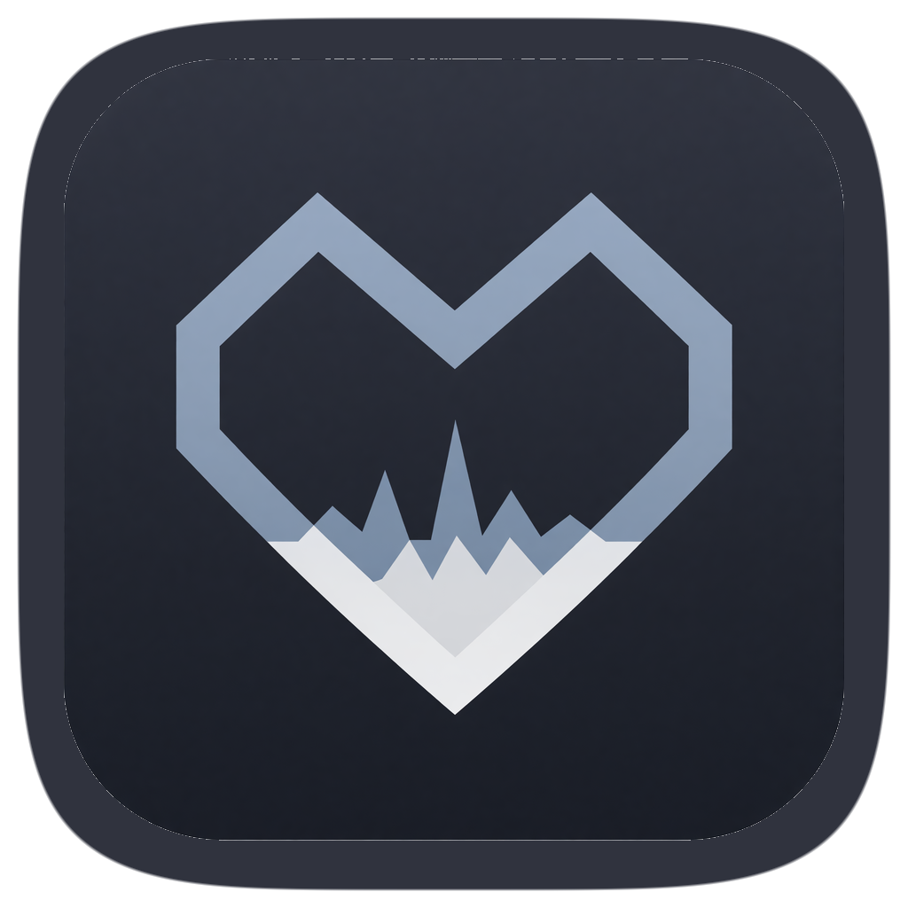
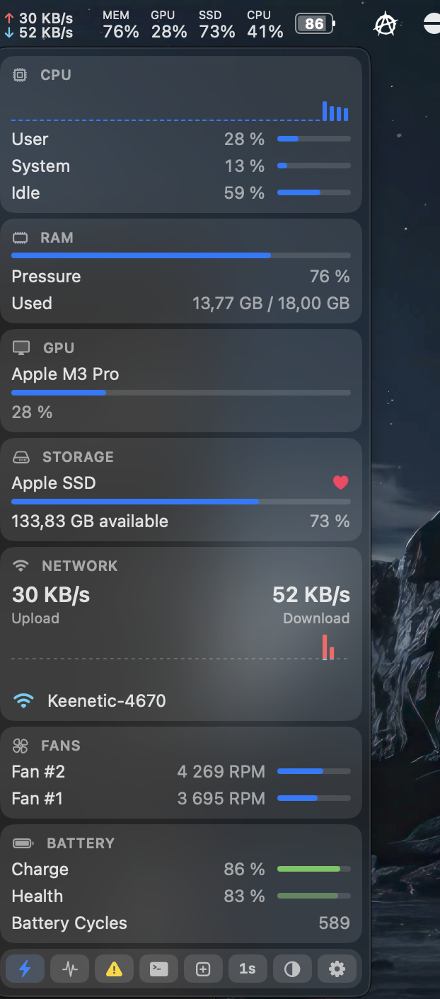

<p align="center">
  
</p>
<h1 align="center">Sino</h1>
<p align="center">
  Native macOS menu-bar system monitor.
</p>
<p align="center">
  <a href="https://github.com/Aduersarius/sino/stargazers"></a>
  <a href="https://github.com/Aduersarius/sino/blob/main/LICENSE"></a>
  
  
</p>

<p align="center">
  
</p>

## Highlights

- Dark Mode
- Native Swift / SwiftUI, no third-party libraries
- Menu-bar chips: CPU, GPU, MEM, SSD, network ↑↓, battery
- Hover a card for a side panel (cores, processes, IPs, …)
- SMC fans and battery health
- Process list only while the dropdown is open

## OS Requirement

macOS 14+ on Apple Silicon. Xcode Command Line Tools for install-from-source.

## Installation

### One line

```bash
curl -fsSL https://raw.githubusercontent.com/Aduersarius/sino/main/install.sh | bash
```

Builds from `main`, copies `Sino.app` to `/Applications`, opens it.

### Homebrew

```bash
brew tap Aduersarius/sino https://github.com/Aduersarius/sino
brew install sino
cp -R "$(brew --prefix)/opt/sino/Sino.app" /Applications && open /Applications/Sino.app
```

### From source

```bash
git clone https://github.com/Aduersarius/sino.git
cd sino
./build.sh
open Sino.app
```

**Unsigned (ad-hoc).** First launch may need Right-click → Open. No App Store / notarized zip yet.

## Notes

- Menu extra only (`LSUIElement`) — no Dock icon.
- Wi-Fi **SSID** needs Location. Deny → the row stays “Wi-Fi”.
- `nettop` / process tables run only while the dropdown is open.

## License

[MIT](LICENSE)
