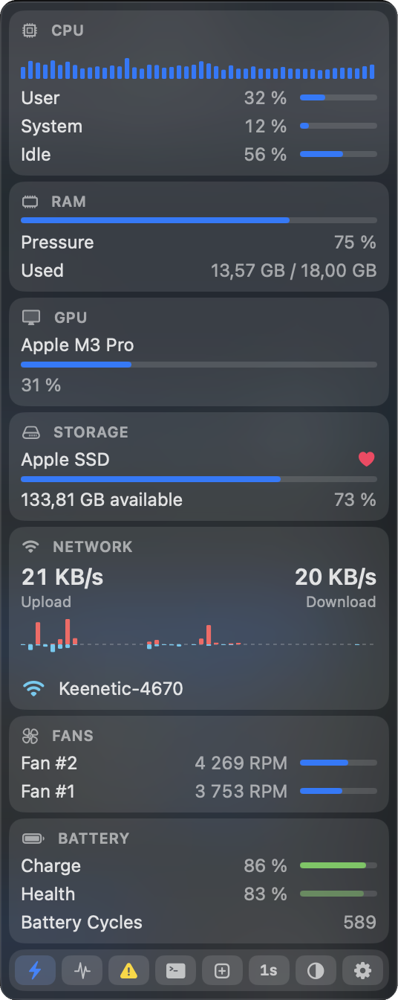

<p align="center">
  
</p>
<h1 align="center">Sino</h1>
<p align="center">
  Fast, ultra-lightweight native macOS menu-bar system monitor for Apple Silicon.
</p>
<p align="center">
  <a href="https://github.com/Aduersarius/sino/stargazers"></a>
  <a href="https://github.com/Aduersarius/sino/blob/main/LICENSE"></a>
  
  
  
  
</p>

<p align="center">
  
</p>
<p align="center">
  
</p>

## Highlights

- **Ultra-lightweight:** ~30 MB RAM, 2.7 MB bundle, <1% idle CPU. Zero external dependencies.
- **Adaptive:** Process tables and heavy metrics run only while the dropdown is open.
- **Menu-bar chips:** CPU, GPU, RAM, SSD, network ↑↓, fans, battery — customizable and reorderable.
- **Side panels:** Hover any card for detailed core, process, or network diagnostics.
- **SMC integration:** Real-time fan speeds and thermal sensors.
- **Customizable:** Light/Dark/System themes with dynamic icon, liquid glass frost, refresh interval (0.5s–5s), and app shortcuts.

## OS Requirement

macOS 14+ on Apple Silicon (M1/M2/M3/M4). Command Line Tools only if compiling from source.

---

## Installation

### Download

Grab the [Latest release](https://github.com/Aduersarius/sino/releases/latest) — `Sino.app.zip` (Apple Silicon, unsigned).

### One-Line Install

```bash
curl -fsSL https://raw.githubusercontent.com/Aduersarius/sino/main/install.sh | bash
```

Prefers the release zip; falls back to building `main`. Installs directly to `/Applications` and launches.

### Homebrew

```bash
brew install Aduersarius/tap/sino
```

### From Source

```bash
git clone https://github.com/Aduersarius/sino.git
cd sino
./build.sh
open /Applications/Sino.app
```

> **Note on Security:** As an ad-hoc signed build, macOS Gatekeeper may require **Right-click → Open** on the first launch.

---

## Notes

- **Menu Extra (`LSUIElement`):** Operates exclusively in the status bar with zero Dock clutter.
- **Wi-Fi SSID:** macOS requires Location permission to display the active Wi-Fi SSID. If denied, Sino gracefully displays "Wi-Fi".
- **Zero-Waste Profiling:** `nettop` and process inspection tables run strictly while the dropdown is open.

---

## License

[MIT](LICENSE)
